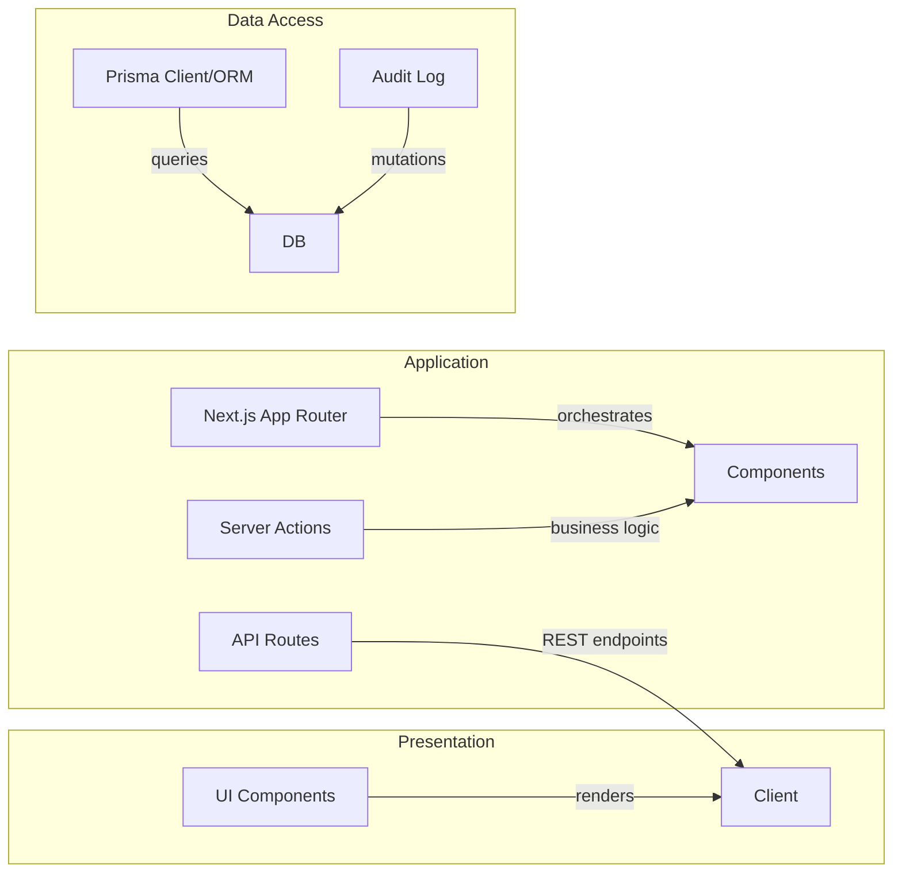

# Phase 6 — Professionalization

## 6.1 Tooling: Linting, Formatting, Type Checking

### ESLint config (`eslint.config.mjs` — already exists, review needed):

The existing `eslint.config.mjs` at root was not fully read but exists. Need to verify it has:
- `@typescript-eslint/parser` or `typescript` parser configured
- `next/core-web-vitals` rule set
- No `ignorePatterns` that skip `src/lib/` or `src/component/`
- Recommended Next.js settings

**Current state**: Need to read and potentially rewrite. Typical professional config:

```mjs
import tseslint from "@typescript-eslint/eslint-plugin";
import tsParser from "@typescript-eslint/parser";
import nextConfig from "eslint/config/js.config.js"; // or next/core-web-vitals

export default tseslint.config({
  languageOptions: {
    parser: tsParser,
    parserOptions: {
      ecmaVersion: 2022,
      sourceType: "module",
    },
  },
  plugins: [
    tseslint,
    // eslint-plugin-import, eslint-plugin-react if needed
  ],
  rules: {
    "no-unused-vars": "error",
    "no-explicit-any": "error",
    "react/jsx-props-no-duplicates": "error",
    "react/react-in-jsx-scope": "off", // Next.js handles this
  },
});
```

### Missing: `tsconfig.json` strictness review

`tsconfig.json:7` has `"strict": true` — good. But:
- `"skipLibCheck": true` skips type checking of `.d.ts` files — could hide real issues
- `"allowJs": true` allows JS files in TS project — fine for `next-env.d.ts`
- No `noImplicitAny: true` explicitly (covered by `strict: true`)
- Missing `forceConsistentCasingInFileNames: true` — already implied by `strict: true` in latest TS

**Recommendation**: Keep `strict: true`, add `"noImplicitAny": true`, `"strictNullChecks": true`, `"alwaysStrict": true`.

### Pre-commit hooks (husky + lint-staged)

**Not configured**. Add to `package.json` scripts or install husky:

```bash
npm install --save-dev husky lint-staged
npx husky init
```

Add to `package.json`:
```json
"husky": {
  "hooks": {
    "pre-commit": "lint-staged"
  }
}
```

Add to `package.json`:
```json
"lint-staged": {
  "*.{ts,tsx}": ["eslint --fix", "prettier --write"],
  "*.{json,md}": ["prettier --write"]
}
```

### Editor Config (.editorconfig)

**Not present**. Create `.editorconfig` at root:

```
root = true

[*]
charset = utf-8
insert_final_newline = true
trim_trailing_whitespace = true
indent_style = space
indent_size = 2

[*.md]
max_line_length = 120

[*.{ts,tsx}]
indent_style = space
indent_size = 2
```

### Prettier (code formatting)

**Not configured**. Install and config:

```bash
npm install --save-dev prettier
```

Create `.prettierrc`:
```json
{
  "semi": true,
  "trailingComma": "es5",
  "singleQuote": true,
  "printWidth": 100,
  "tabWidth": 2
}
```

Or integrate with ESLint plugin.

---

## 6.2 CI/CD: Pipeline & Branch Protection

### GitHub Actions workflow (`.github/workflows/ci-cd.yml` — create):

```yaml
name: CI/CD Pipeline

on:
  push:
    branches: [main, develop]
  pull_request:
    branches: [main, develop]
  schedule:
    - cron: '0 2 * * 1'  # Weekly full run

jobs:
  test:
    runs-on: ubuntu-latest
    steps:
      - uses: actions/checkout@v4
      
      - name: Setup Node.js
        uses: actions/setup-node@v4
        with:
          node-version: '20'
          
      - name: Install dependencies
        run: npm ci
        
      - name: Lint
        run: npm run lint
        
      - name: Typecheck
        run: npx tsc --noEmit
        
      - name: Test
        run: npm test
        
      - name. Build
        run: npm run build
  
  security-scan:
    needs: test
    runs-on: ubuntu-latest
    steps:
      - uses: actions/checkout@v4
      
      - name: Install dependencies
        run: npm ci
        
      - name: Dependency scan
        run: npm audit --audit-level=high
      
      - name: Prisma vulnerability check
        run: npx prisma audit

  deploy:
    needs: test
    runs-on: ubuntu-latest
    if: github.ref == 'refs/heads/main'
    steps:
      - uses: actions/checkout@v4
      
      - name: Setup Node.js
        uses: actions/setup-node@v4
        with:
          node-version: '20'
          
      - name: Install dependencies
        run: npm ci
        
      - name: Build
        run: npm run build
        
      - name: Deploy to Vercel
        uses: amondnet/vercel-action@v20
        with:
          vercel-token: ${{ secrets.VERCEL_TOKEN }}
          vercel-organization-id: ${{ secrets.VERCEL_ORG_ID }}
          vercel-project-id: ${{ secrets.VERCEL_PROJECT_ID }}

  # Branch protection rules (repository settings, not code):
  # - Require review from at least 1 approver
  # - Require status checks to pass: "CI/CD Pipeline", "Security Scan"
  # - Include administrators
  # - Require linear history
  # - Do not allow bypasses
```

### Branch protection rules (GitHub repo settings):
- ✅ Require pull request reviews before merging
- ✅ Require status checks to pass (CI/CD Pipeline, Security Scan)
- ✅ Include administrators
- ✅ Require linear history
- ✅ Do not allow conversation resolution to bypass required reviews
- ✅ Maximum number of reviewers: 2
- ✅ Require code owner reviews for relevant files

---

## 6.3 Documentation

### `README.md` — create (if not exists; check):

The repo has `README.md` at root. Let me verify its content quality... Actually I read the directory listing and it showed `README.md` exists. Need to check if it's professional.

**If insufficient**, create professional `README.md`:

```
# School Management System

A school management platform built with Next.js 16, PostgreSQL, Prisma ORM, and NextAuth.

## Purpose

Manages students, teachers, classes, subjects, attendance, grades, timetables, events, announcements, and finance/payments for a school community.

## Audience

Admins, teachers, students, and parents — role-separated dashboards.

## Tech Stack

- **Frontend**: Next.js 16 (App Router), React 19, TypeScript, TailwindCSS v4
- **Backend**: Node.js, PostgreSQL, Prisma ORM, NextAuth v5
- **Styling**: TailwindCSS, lucide-react, framer-motion
- **Charts**: recharts, @fullcalendar/*
- **Forms**: react-hook-form, zod validation

## Quick Start

```bash
# 1. Clone and configure
git clone <repo-url>
cp .env.example .env.local
# Edit .env.local with your PostgreSQL credentials and auth keys

# 2. Install and setup database
npm install
npx prisma generate
# Create PostgreSQL database: createdb school_db
npx prisma migrate dev --name init
npx prisma db seed

# 3. Run development
npm run dev
# Open http://localhost:3000
```

## Available Scripts

| Script | Description |
|---|---|
| `npm run dev` | Start dev server with hot reload |
| `npm run build` | Generate Prisma client and build for production |
| `npm run start` | Start production server |
| `npm run lint` | Run ESLint |
| `npm run test` | Run Vitest test suite |
| `npm run db:generate` | Generate Prisma client |
| `npm run db:push` | Push schema changes to DB |
| `npm run db:migrate` | Create and run migrations |
| `npm run db:seed` | Seed database with test data |

## Learning Outcomes / Academic Context

This project was built as part of a [course/context] to demonstrate full-stack application development including:
- Role-based access control (RBAC)
- Soft-delete patterns and audit logging
- Server-side rendering and API routes
- Database design with Prisma ORM
- Client-state management with React Hook Form and Zod

## Contributing

See `.github/CONTRIBUTING.md` or open an issue/PR on the repository.

## License

MIT
```

### `ARCHITECTURE.md` — create with diagrams:

```markdown
# School Management System — Architecture

## High-Level Overview

```mermaid
graph TD
  subgraph "Client (Browser)"
    A[Next.js App Router]:::client
    B[React Components]:::client
    C[Next/Themes]:::client
  end
  
  subgraph "Edge / CDN"
    D[Next.js Middleware]:::edge
    E[Security Headers]:::edge
  end
  
  subgraph "Server (Next.js App Router)"
    F[Route Handlers]:::server
    G[Server Components]:::server
    H[API Routes]:::server
    I[NextAuth Authentication]:::server
    J[Prisma Client]:::server
  end
  
  subgraph "Database (PostgreSQL)"
    K[prisma.schema]:::db
    L[AuditLog]:::db
    M[All tables]:::db
  end
  
  A -->|requests| F
  F -->|calls| J
  J -->|queries| K
  K -->|writes/reads| M
  I -->|jwt| session management
  E -->|headers| all responses
```

## Layering



## Data Flow

1. User navigates to `/dashboard/teacher`
2. Root layout renders `SessionProvider` + `ThemeProvider` + `NuqsProvider`
3. Page component `await auth()` — reads JWT from cookie
4. If authorized, server components fetch data via Prisma
5. Data flows to client components via React Server Components stream
6. UI renders with TailwindCSS styling

## API Design

| Pattern | Example |
|---|---|
| Resource naming | `/api/students`, `/api/teachers` |
| HTTP verbs | `GET` = list/retrieve, `POST` = create, `PUT` = update, `DELETE` = remove |
| Status codes | `200` = success, `201` = created, `400` = bad request, `401` = unauth, `403` = forbidden, `404` = not found, `500` = server error |
| Pagination | `?page=1&limit=20&sort=name&dir=asc` |
| Filtering | `?status=pending&type=tuition` |
| Error envelope | `{ success: boolean, data?: T, error?: { code: string, message: string } }` |
```

### `API.md` or OpenAPI spec:

Since there's no OpenAPI/Swagger, create a minimal one:

```markdown
# API Specification

## Authentication

### `POST /api/auth/credentials` (implicit — handled by NextAuth `[...nextauth]` endpoint)

**Description**: Credential-based login via NextAuth.

**Request Body**:
```json
{
  "email": "user@school.com",
  "password": "password123"
}
```

**Response**:
```json
{
  "success": true,
  "session": { "user": { "id": "1", "name": "John", "role": "teacher" } }
}
```

**Errors**:
- `401`: Invalid credentials
- `403`: Account inactive
- `429`: Rate limit exceeded (5 attempts/15min)

### `GET /dashboard/:role/*`

**Description**: Protected dashboard routes. Role-based access control.

**Authentication**: Valid NextAuth JWT required in cookie.

**Authorization**: Server-side check — client-side menu visibility is UI-only.

**Errors**:
- `401`: No valid session
- `403`: Insufficient role

*(Full API spec would list every endpoint with request/response schemas)*

### `POST /students` (create student)

**Request Body** (Zod schema): see `src/lib/formValidation.ts:59-41`

**Response**: `{ id: string, success: boolean }`

## Webhooks

### Payment webhook (third-party callback)

- **URL**: `/api/webhooks/payment` (not yet implemented)
- **Method**: `POST`
- **Authentication**: HMAC signature verification (not yet implemented)
- **Payload**: `{ feeId, amount, method, reference, status }`
- **Response**: `{ status: "acknowledged" }`